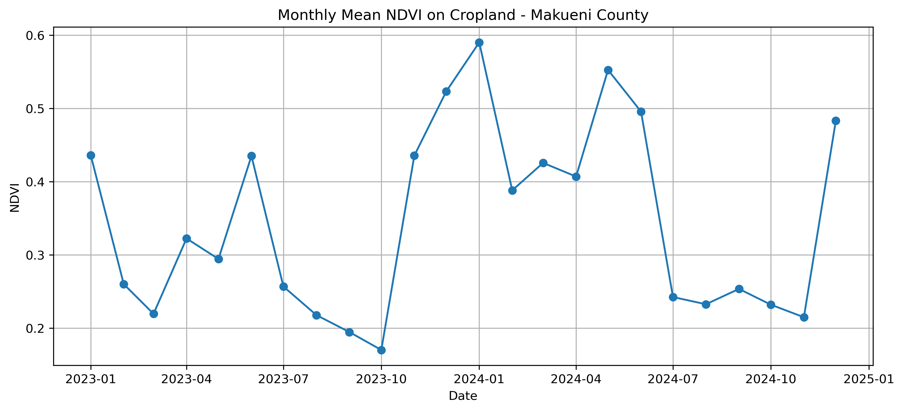
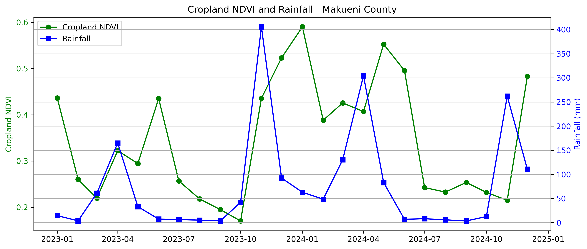

# Agricultural Landscape Resilience Explorer

An exploratory geospatial project investigating how agricultural landscapes respond and recover from climatic stress using satellite imagery and environmental datasets.

## Objectives

- Monitor vegetation dynamics
- Detect drought impacts
- Measure recovery after stress events
- Identify resilient agricultural landscapes

## Study Area

Current prototype:

- Makueni County, Kenya

The methodology is designed to be transferable to other agricultural regions and countries.

## Methodology

The analytical workflow consists of the following steps:

1. Compute monthly vegetation conditions (NDVI) from Sentinel-2 imagery.
2. Compute monthly rainfall totals using CHIRPS.
3. Restrict vegetation analysis to agricultural land using ESA WorldCover.
4. Merge vegetation and rainfall into a unified monthly dataset.
5. Identify candidate drought events from rainfall time series.
6. Measure vegetation decline following drought events.
7. Estimate vegetation recovery time.
8. Compute resilience indicators summarizing drought response.

## Technologies

- Python
- Google Earth Engine
- GIS
- Remote Sensing
- Sentinel-2
- CHIRPS Rainfall

## Status

Project initiated June 2026.

## Progress

### Completed

- [x] Google Earth Engine setup
- [x] Makueni County study area definition
- [x] Sentinel-2 imagery workflow
- [x] Monthly NDVI time series (2020–2024)
- [x] CHIRPS rainfall time series (2020–2024)
- [x] Combined rainfall–vegetation dataset
- [x] ESA WorldCover cropland masking
- [x] Monthly cropland NDVI time series
- [x] Rainfall anomaly analysis
- [x] Candidate drought event detection
- [x] Vegetation response and recovery analysis
- [x] Initial resilience indicators

### In Progress

- [ ] Comparative analysis across regions
- [ ] Multi-county resilience framework
- [ ] Interactive dashboard

## First Results

### Monthly NDVI

Monthly average NDVI for Makueni County (2023–2024).

Initial observations:

* NDVI exhibits a clear seasonal pattern.
* Vegetation levels tend to peak between December and May.
* January 2023 appears less vegetated than January 2024.

### Monthly Rainfall

Monthly average rainfall for Makueni County (2023–2024).

Initial observations:

* Rainfall varies strongly between months.
* An extreme rainfall event occurred in November 2023.
* Rainfall peaks appear to be followed by increases in vegetation.

### NDVI and Rainfall

Monthly rainfall and county-wide NDVI for Makueni County (2023–2024).

Initial observations:

* Vegetation and rainfall follow similar seasonal patterns.
* Peaks in rainfall appear to be followed by peaks in vegetation.
* Visual inspection suggests a lagged vegetation response to rainfall.

### Cropland NDVI

Monthly average NDVI calculated using only cropland pixels identified from the ESA WorldCover land-cover dataset.

Initial observations:

* Cropland NDVI exhibits a clear seasonal pattern.
* Cropland vegetation dynamics remain consistent with the broader county-wide signal.
* Agricultural vegetation appears slightly less green than the county-wide average.

### Cropland NDVI and Rainfall

Monthly rainfall and cropland NDVI for Makueni County (2023–2024).

Initial observations:

* Rainfall peaks appear to be followed by increases in cropland vegetation.
* An extreme rainfall event occurred in November 2023 and was followed by elevated vegetation conditions in subsequent months.
* The lagged relationship remains visible after restricting the analysis to agricultural land.

### Climate–Vegetation Relationship

Restricting the analysis to cropland confirmed that agricultural vegetation responds to rainfall with a measurable delay.

Correlation between cropland NDVI and rainfall:

- Same month rainfall: **0.24**
- Rainfall lagged by 1 month: **0.69**
- Rainfall lagged by 2 months: **0.65**

These results indicate that vegetation conditions are more strongly associated with rainfall from the previous one to two months than with rainfall occurring during the same month.

This lag is consistent with the time required for rainfall to influence soil moisture and subsequent plant growth.

### Drought Response Analysis

The project now identifies candidate drought events from monthly rainfall time series and evaluates vegetation response for each event.

For every drought event, the workflow estimates:

- Pre-drought vegetation baseline
- Maximum vegetation decline
- Percentage NDVI loss
- Recovery threshold
- Recovery month
- Recovery time

These event-level metrics form the basis of a first resilience assessment for agricultural landscapes.

## Next Steps

The current workflow has established a complete methodology for measuring agricultural resilience at the county scale.

The next stage of the project will focus on:

- Applying the methodology to additional counties
- Comparing resilience across agricultural regions
- Developing standardized resilience indicators
- Building an interactive web platform for exploring results
- Extending the framework to additional environmental variables

The long-term objective is to build a reusable Earth observation framework capable of assessing climate resilience across agricultural landscapes using open satellite and environmental datasets.