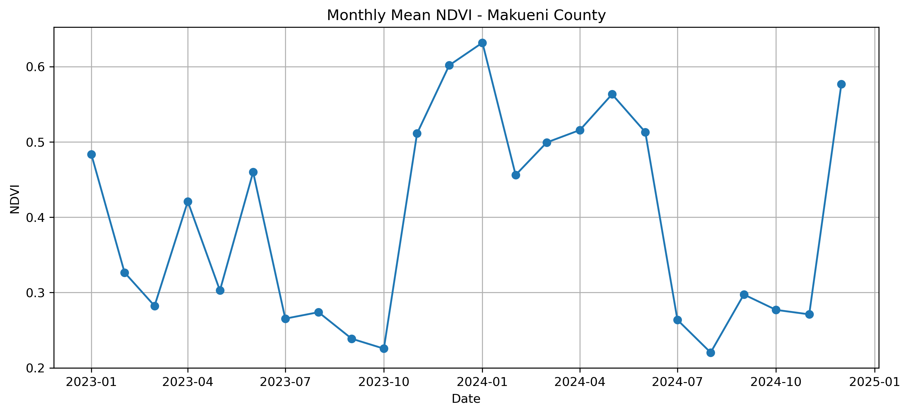
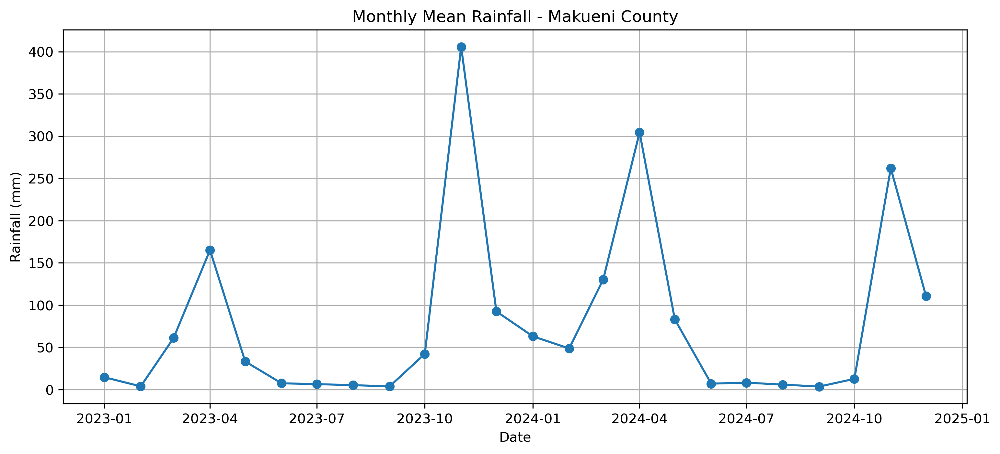

# Agricultural Landscape Resilience Explorer

An exploratory geospatial project investigating how agricultural landscapes respond and recover from climatic stress using satellite imagery and environmental datasets.

## Objectives

- Monitor vegetation dynamics
- Detect drought impacts
- Measure recovery after stress events
- Identify resilient agricultural landscapes

## Study Area

Current prototype:

- Makueni County, Kenya

The methodology is designed to be transferable to other agricultural regions and countries.

## Technologies

- Python
- Google Earth Engine
- GIS
- Remote Sensing
- Sentinel-2
- CHIRPS Rainfall

## Status

Project initiated June 2026.

## Progress

### Completed

* [x] Google Earth Engine setup
* [x] Makueni County study area definition
* [x] Sentinel-2 imagery workflow
* [x] NDVI computation
* [x] Monthly NDVI time series (2023–2024)
* [x] CHIRPS rainfall time series (2023–2024)
* [x] Combined rainfall–vegetation dataset
* [x] Initial climate–vegetation relationship analysis

### In Progress

* [ ] Agricultural land masking
* [ ] Drought detection
* [ ] Vegetation recovery metrics
* [ ] Resilience indicators
* [ ] Interactive dashboard

## First Results

### Monthly NDVI

Monthly average NDVI for Makueni County (2023–2024).

Initial observations:

* NDVI exhibits a clear seasonal pattern.
* Vegetation levels tend to peak between December and May.
* January 2023 appears less vegetated than January 2024.

### Monthly Rainfall

Monthly average rainfall for Makueni County (2023–2024).

Initial observations:

* Rainfall varies strongly between months.
* An extreme rainfall event occurred in November 2023.
* Rainfall peaks appear to be followed by increases in vegetation.

### Preliminary Findings

A first comparison between rainfall and vegetation suggests that cropland vegetation responds to rainfall with a delay.

Correlation between cropland NDVI and rainfall:

* Same month rainfall: 0.24
* Rainfall lagged by 1 month: 0.69
* Rainfall lagged by 2 months: 0.65

These results indicate that cropland vegetation conditions are more strongly associated with rainfall from the previous 1–2 months than with rainfall occurring during the same month.

The relationship remained strong after restricting the analysis to agricultural land, suggesting that the lagged response is not solely driven by other vegetation types within the county.

This pattern is consistent with the time required for rainfall to influence soil moisture and subsequent plant growth.

These results are exploratory and intended to generate hypotheses rather than establish causal relationships.